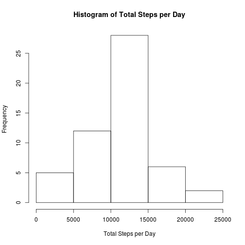
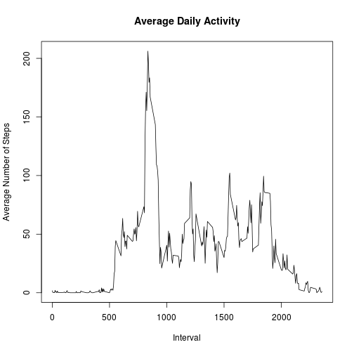
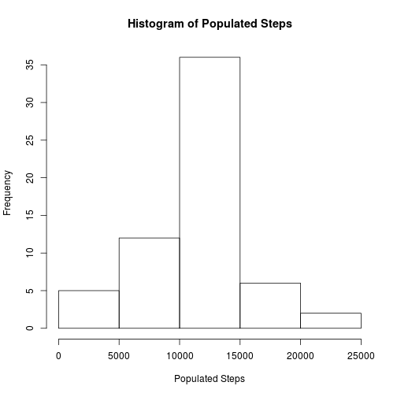

## Loading and preprocessing the data
The following code will extra the zip archive:

```r
setwd("~/datasciencespecialization/ReproducibleResearch/RepData_PeerAssessment1")
unzip("activity.zip", overwrite=TRUE)
activity <- read.csv("activity.csv")
```


## What is mean total number of steps taken per day?
(1) Calculate the total number of steps taken per day:

The code below will perform this calculation.

(2) If you do not understand the difference between a histogram and a barplot, 
research the difference between them. Make a histogram of the total number of 
steps taken each day

To make a histogram of the total number of steps taken each day, the dataset is
filtered to remove NA values, and then summarized by date with total steps.

```r
library(dplyr)

activityNoNa <- filter(activity, is.na(steps) == FALSE)
totalStepsPerDay <- activityNoNa %>%
    group_by(date) %>%
    #Calculate the total number of steps taken per day
    summarize(totalSteps = sum(steps)) 

#Make a histogram of the total number of steps taken each day
hist(totalStepsPerDay$totalSteps, main = "Histogram of Total Steps per Day",
     xlab = "Total Steps per Day")    
```

 

(3) Calculate and report the mean and median of the total number of steps taken 
per day

Throughout this analysis, scalar values are presented using r code 
chunks, and not inline, because the author:

* wants to show the code that produced the results
* and does not want to restate code twice, once hidden inline, and a second time
in an output chunk.

The mean of the total number of steps taken per day is computed by:

```r
mean(totalStepsPerDay$totalSteps)
```

```
## [1] 10766.19
```

The median of the total number of steps taken per day is computed by:

```r
median(totalStepsPerDay$totalSteps)
```

```
## [1] 10765
```


## What is the average daily activity pattern?
(1) Make a time series plot (i.e. type = "l") of the 5-minute interval (x-axis) 
and the average number of steps taken, averaged across all days (y-axis)

The relationship between the average number of steps taken by interval across 
all days can be seen here:


```r
avgDailyActivity <- activityNoNa %>%
    group_by(interval) %>%
    summarize(meanSteps = mean(steps))

plot(x = avgDailyActivity$interval, y = avgDailyActivity$meanSteps,
     main="Average Daily Activity", type = "l", xlab = "Interval",
     ylab="Average Number of Steps")
```

 

(2) Which 5-minute interval, on average across all the days in the dataset, 
contains the maximum number of steps?

The 5-minute interval which contains the maximum number of steps across all days
is computed by:

```r
avgDailyActivity$interval[which.max(x = avgDailyActivity$meanSteps)]
```

```
## [1] 835
```


## Imputing missing values
(1) Calculate and report the total number of missing values in the dataset (i.e. 
the total number of rows with NAs)

The total number of missing values in the dataset is computed by:

```r
sum(is.na(activity))
```

```
## [1] 2304
```

(2) Devise a strategy for filling in all of the missing values in the dataset.
The strategy does not need to be sophisticated. For example, you could use the 
mean/median for that day, or the mean for that 5-minute interval, etc.

The author has chosen to use the mean for that 5-minute interval.

(3) Create a new dataset that is equal to the original dataset but with the 
missing data filled in.


```r
activityPopulated <- activity %>%
    mutate(steps = ifelse(is.na(steps),
                          avgDailyActivity[which(avgDailyActivity$interval == interval)]$meanSteps,
                          steps))
```

(4) Make a histogram of the total number of steps taken each day and Calculate 
and report the mean and median total number of steps taken per day.


```r
activityPopulatedByDate <- activityPopulated %>%
    group_by(date) %>%
    #Calculate the total number of steps taken per day
    summarize(totalSteps = sum(steps))

hist(activityPopulatedByDate$totalSteps,
     main = "Histogram of Populated Steps", xlab = "Populated Steps")  
```

 

The mean of the total number of steps taken per day is computed by:

```r
mean(activityPopulatedByDate$totalSteps)
```

```
## [1] 10766.19
```

The median of the total number of steps taken per day is computed by:

```r
median(activityPopulatedByDate$totalSteps)
```

```
## [1] 10766.19
```

Do these values differ from the estimates from the first part of the assignment?

The mean remained identical, and the median went up 
0.0110421
%.  There was essentially little to no change in the mean or median from the 
first part of the assignment.

What is the impact of imputing missing data on the estimates of the total daily
number of steps?

The impact of imputing missing data was that more data was inserted near the 
mean and median of the distribution.


## Are there differences in activity patterns between weekdays and weekends?
(1) Create a new factor variable in the dataset with two levels – “weekday” and 
“weekend” indicating whether a given date is a weekday or weekend day.


```r
activityPopulatedDayType <- activityPopulated %>%
    mutate(dayOfWeek = weekdays(as.Date(date, "%Y-%m-%d")),
           dayType = factor(ifelse(((dayOfWeek == "Sunday") | (dayOfWeek == "Saturday")),
                                   "Weekend",
                                   "Weekday")))
```


(2) Make a panel plot containing a time series plot (i.e. type = "l") of the 
5-minute interval (x-axis) and the average number of steps taken, averaged 
across all weekday days or weekend days (y-axis).


```r
library(lattice)

activityByIntervalDayType <- activityPopulatedDayType %>%
    group_by(interval, dayType) %>%
    summarize(meanSteps = mean(steps))

xyplot(meanSteps ~ interval | dayType, data = activityByIntervalDayType, 
       layout = c(1, 2), main = "Number of Steps vs Interval by Day Type",
       type="l", xlab = "Interval", ylab = "Number of Steps")
```

 
